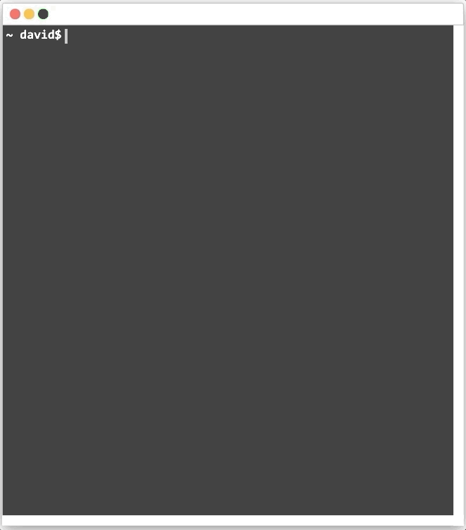
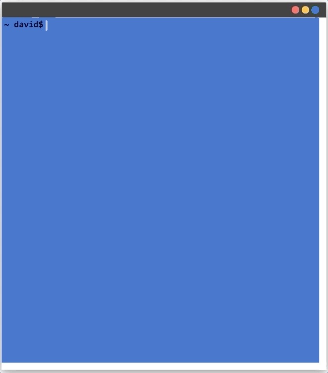

![Built With Stencil](https://img.shields.io/badge/-Built%20With%20Stencil-16161d.svg?logo=data%3Aimage%2Fsvg%2Bxml%3Bbase64%2CPD94bWwgdmVyc2lvbj0iMS4wIiBlbmNvZGluZz0idXRmLTgiPz4KPCEtLSBHZW5lcmF0b3I6IEFkb2JlIElsbHVzdHJhdG9yIDE5LjIuMSwgU1ZHIEV4cG9ydCBQbHVnLUluIC4gU1ZHIFZlcnNpb246IDYuMDAgQnVpbGQgMCkgIC0tPgo8c3ZnIHZlcnNpb249IjEuMSIgaWQ9IkxheWVyXzEiIHhtbG5zPSJodHRwOi8vd3d3LnczLm9yZy8yMDAwL3N2ZyIgeG1sbnM6eGxpbms9Imh0dHA6Ly93d3cudzMub3JnLzE5OTkveGxpbmsiIHg9IjBweCIgeT0iMHB4IgoJIHZpZXdCb3g9IjAgMCA1MTIgNTEyIiBzdHlsZT0iZW5hYmxlLWJhY2tncm91bmQ6bmV3IDAgMCA1MTIgNTEyOyIgeG1sOnNwYWNlPSJwcmVzZXJ2ZSI%2BCjxzdHlsZSB0eXBlPSJ0ZXh0L2NzcyI%2BCgkuc3Qwe2ZpbGw6I0ZGRkZGRjt9Cjwvc3R5bGU%2BCjxwYXRoIGNsYXNzPSJzdDAiIGQ9Ik00MjQuNywzNzMuOWMwLDM3LjYtNTUuMSw2OC42LTkyLjcsNjguNkgxODAuNGMtMzcuOSwwLTkyLjctMzAuNy05Mi43LTY4LjZ2LTMuNmgzMzYuOVYzNzMuOXoiLz4KPHBhdGggY2xhc3M9InN0MCIgZD0iTTQyNC43LDI5Mi4xSDE4MC40Yy0zNy42LDAtOTIuNy0zMS05Mi43LTY4LjZ2LTMuNkgzMzJjMzcuNiwwLDkyLjcsMzEsOTIuNyw2OC42VjI5Mi4xeiIvPgo8cGF0aCBjbGFzcz0ic3QwIiBkPSJNNDI0LjcsMTQxLjdIODcuN3YtMy42YzAtMzcuNiw1NC44LTY4LjYsOTIuNy02OC42SDMzMmMzNy45LDAsOTIuNywzMC43LDkyLjcsNjguNlYxNDEuN3oiLz4KPC9zdmc%2BCg%3D%3D&colorA=16161d&style=flat-square)

# CSS Terminal

CSS Terminal is a web component which lets you simulate a terminal printing commands and results in your browser. All the transitions and animations are done with CSS - very few JavaScript was used, only for the web components creation!

You can also easily style your terminal using the [advanced `::part()` CSS pseudo-selectors](#Using-the-advanced-::part()-pseudo-selectors) or you may get your desired terminal just [using the CSS variables which are available](#css-variables) for that purpose!

<p align="left">
  
  
</p>

---


## Importing this component

### Script tag

- Put this script `<script src='https://unpkg.com/dlc-css-terminal@latest/dist/dlc-css-terminal/dlc-css-terminal.js'></script>` in the head of your index.html
- Then you can use the element anywhere in your template, JSX, html etc

### Node Modules
- Run `npm i dlc-css-terminal --save`
- Put a script tag similar to this `<script src='node_modules/dlc-css-terminal/dist/dlc-css-terminal.js'></script>` in the head of your index.html
- Then you can use the element anywhere in your template, JSX, html etc

### In a stencil-starter app
- Run `npm i dlc-css-terminal --save`
- Add an import to the npm packages `import dlc-css-terminal;`
- Then you can use the element anywhere in your template, JSX, html etc

# Using this web component

Once you have imported the web component within your project, you simply use it in yout HTML! Actually, two web components need to be used in order to achieve the desired results: `<dlc-cssterminal>` and `<dlc-cssterminal-block>`.

An example:

```html
  <dlc-cssterminal shell="~ david$">
    <dlc-cssterminal-block command="ls">
      Desktop Documents Downloads Pictures Videos
    </dlc-cssterminal-block>
    <dlc-cssterminal-block command="echo $USER" delay="3">
      David López Castellote
    </dlc-cssterminal-block>
    <dlc-cssterminal-block command="pwd" delay="14">
      /home/david
    </dlc-cssterminal-block>
    <dlc-cssterminal-block command="cat package.json" delay="18" words="14">
      <pre>
{
  "name": "dlc-css-terminal",
  "version": "0.0.1",
  "description": "Stencil Component Starter",
  "main": "dist/index.js",
  "scripts": {
    "build": "stencil build --docs",
    "start": "stencil build --dev --watch --serve",
    "test": "stencil test --spec --e2e",
    "test.watch": "stencil test --spec --e2e --watchAll"
  },
  "devDependencies": {
    "@stencil/core": "1.0.0-beta.5"
  },
  "dependencies": {
    "@stencil/sass": "^0.2.3",
    "@types/jest": "^24.0.13"
  }
}
          
      </pre>
    </dlc-cssterminal-block>
    <dlc-cssterminal-block shell="~ david$" command="&nbsp;" delay="35"></dlc-cssterminal-block>
  </dlc-cssterminal>
```

As you can see, both the `dlc-cssterminal` and `dlc-cssterminal-block` are needed in order to successfully build our terminal. Check out the documentation of their properties in the own documentation of each component:
* [dlc-cssterminal](./src/components/dlc-cssterminal/readme.md)
* [dlc-cssterminal-block](./src/components/dlc-cssterminal-block/readme.md)

# Styling the terminal

## Using the advanced `::part()` pseudo-selectors

If you have no idea of what's this, [check it out here](https://meowni.ca/posts/part-theme-explainer/). In order to style some of the elements of the terminal, these *parts* have been defined:

### `<dlc-cssterminal>`

* `terminal`
* `terminal-header`
* `terminal-header-buttons`
* `terminal-header-button-close`
* `terminal-header-button-minimize`
* `terminal-header-button-maximize`
* `terminal-content`

Example:

```css
dlc-cssterminal::part(terminal-content) {
    background-color: rgb(47,105,198);
}
dlc-cssterminal::part(terminal-header) {
    background-color: #323232;
}
dlc-cssterminal::part(terminal-header-buttons) {
    right: 0;
}
```

### `<dlc-cssterminal-block>`

* `terminal-content-command`
* `terminal-content-result`

Example:

```css
dlc-cssterminal-block::part(terminal-content-shell) {
    color: black;
}
dlc-cssterminal-block::part(terminal-content-command) {
    color: white;
}
dlc-cssterminal-block::part(terminal-content-result) {
    color: greenyellow;
}
```

## CSS variables

The following CSS variables are available in order to style the terminal:

> No idea of how to use CSS variables? [Learn it out!](https://www.w3schools.com/css/css3_variables.asp)

 * `--dlc-cssterminal-hem`: Specify the font-size in order to calculate widths and heights (default is 10px)
 * `--dlc-cssterminal-content-bgcolor`: The terminal's content background color (default is #323232)
 * `--dlc-cssterminal-header-bgcolor`: The terminal's header background color (default is #f6f6f6)
 * `--dlc-cssterminal-bordercolor`: The terminal's border color (default is #b8b8b8)
 * `--dlc-cssterminal-header-button-close-color`: The terminal's header close button color (default is #fc645f)
 * `--dlc-cssterminal-header-button-minimize-color`: The terminal's header close button color (default is #fdbe41)
 * `--dlc-cssterminal-header-button-maximize-color`: The terminal's header close button color (default is #35cc4b)
 * `--dlc-cssterminal-font-family`: The terminal's font family (default is Consolas,monaco,monospace)

 * `--dlc-cssterminal-primary-font-color`: The terminal's primary font color, applied on shell and command texts (default is #fff)
 * `--dlc-cssterminal-secondary-font-color`: The terminal's secondary font color, applied on result text (default is #bfbdbd)
